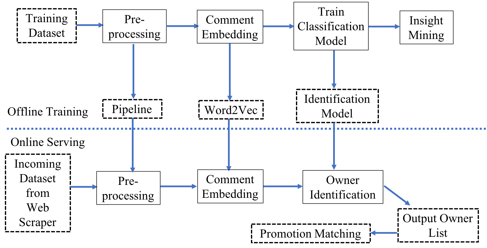

# Recommendation-System-Based-on-YouTube-Review

Nowadays, more and more companies have user data at hand. But how could they make full use of the data? the answer is, precision advertising! For this purpose, you need a product to identify the potential customers and find their interest. So here, I try to use an example to show, how I handle this. This example is, identifying cat and dog owners from youtube reviews 
To do this：

1. extract YouTube reviews from lovely dog and cat videos

2. label the user who has cats and dogs, by the text containing: my dog, my cat, my kitty, my poppy, and so on

This is the workflow, I have a training dataset, then I clean data, do comment embedding, build classifiers for pet owners, and evaluate the classifier performance;  then extract important topics from pet owners

Then, I deploy the pipeline to deal with the incoming datasets and output the owner list automatically for promotion matching. 

The offline training data set has 5820036 rows and about 616MB.

How to use: 

1. Run youtube_cat_dog_v3.ipynb for offline training.
2. Run scrape_youtube_comment_v2.ipynb to extract new reviews in youtube.
3. Run youtube_cat_dog_pipeline_v3.ipynb to extract dog and cat onwers from new reviews.  

In the end, the user list will be saved in the datacsv folder.
